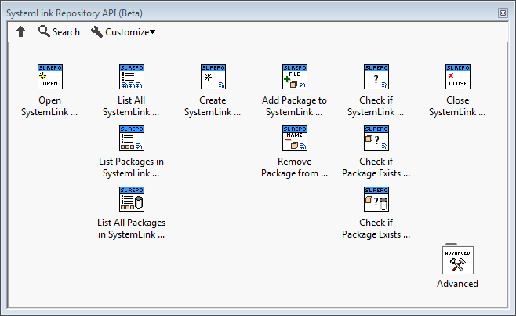

# systemlink-repo-api-labview
SystemLink Repository and Feed API for LabVIEW 2017 or later

## Overview
This is a beta LabVIEW API for SystemLink Repository and Feed tasks.  Please feel free to use this API, give feedback, and contribute.  NI will use this feedback to create an official NIPM API in the future.

You can use this API to:
* List the feeds and packages in a SystemLink repository
* Create a feed in a SystemLink repository
* Add packages to feeds, remove packages from feeds, list packages in feeds
* ...

## How to Install
Prerequisites:
* LabVIEW 2017 or later
* [NI Package Manager](http://www.ni.com/downloads/ni-package-manager) 17.5 or later

Installation Instructions
1. Click on the [Exports](https://github.com/allenh-ni/systemlink-repo-api-labview/tree/master/Exports) folder, and download the most recent .vip file (VIPM package).
2. Double-click the .vip file.  This will launch VI Package Manager to install the NIPM API to LabVIEW 2017 or later.
Note: The .vip file lists a dependency on JSONtext, so installing the .vip file will automatically install JSONtext through VIPM if you have an internet connection
3. In LabVIEW, access the SystemLink Repository API by going to the **Functions Palette»Addons»SystemLink Repository API (Beta)**.

## Documentation
Refer to the Context Help for the installed API.

Note: This API communicates with the SystemLink repository using HTTP calls under-the-hood.  If you are curious, you can find the documentation for the low-level HTTP API for the SystemLink repository is posted on [this forum](https://forums.ni.com/t5/SystemLink/SystemLink-Web-Service-APIs/td-p/3661481).

## Source Code
* **Source** folder - Contains the source code for this API.  At a low-level, this API calls the nipkg command-line interface (CLI).
* **Build Spec** folder - Contains the VIPM build spec (.vipb) used to create the .vip file.
* **Export** folder - Contains versions of the VIPM package (.vip), which you can use to install this API.
